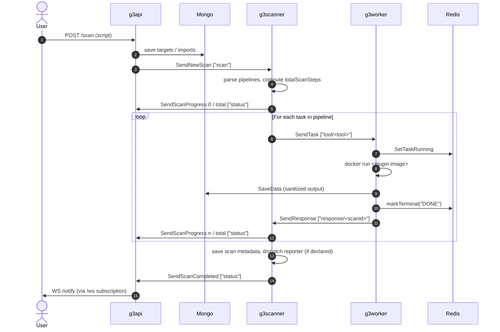

# g3 Messaging Flow — Reference

A reference for the MQTT message types, topics, and lifecycles in g3. Written
to prevent confusion about *what each message means and who it's addressed to*,
not just where it's sent.

If you take one thing from this document: **every message has a specific
audience and a specific meaning.** Two messages may look superficially similar
("task done", "cancel handled") but signal different things to different
components. Misreading the audience of a message is the most common source of
confusion when reading this codebase.

---

## Transport

- **Broker:** Mosquitto.
- **Library:** `github.com/eclipse/paho.mqtt.golang`.
- **QoS:** `2` (exactly-once delivery — see [`MQTT_QOS`](../../src/g3lib/task.go#L23)).
- **`CleanSession`:** `false` (the broker queues messages for known subscribers
  while they're disconnected — needed for work-queue semantics across worker
  restarts).
- **`Retained`:** `false` (`MQTT_PERSIST = false`) — retained is wrong for a
  shared-subscription work queue; a fresh subscriber should not receive an old
  task.
- **Per-publish reliability:** [`SendMQPayload`](../../src/g3lib/task.go#L402)
  retries up to `MQTT_MAX_ATTEMPTS = 3` with timed waits on the paho token
  (timeout `MQTT_QUIESCE = 15s`).

### Two kinds of subscription

This distinction is the central mechanic of the messaging design.

- **Shared subscription (`$share/<group>/<topic>`):** the broker distributes
  messages within the group so **only one subscriber** in the group receives a
  given message. Used for *work distribution* — a task should run on exactly
  one worker, a scan should be picked up by exactly one scanner.
- **Plain subscription (no `$share/` prefix):** the broker delivers each
  message to **every subscriber** of the topic. Used for *coordination
  broadcasts* — every worker needs to know about a cancel; every API instance
  needs to know about a status update.

| Topic | Shared? | Subscriber group |
|---|---|---|
| `scan` | ✅ shared (`$share/g3scanner/scan`) | one scanner picks up each new-scan |
| `tool/<tool>` | ✅ shared (`$share/g3worker/tool/<tool>`) | one worker picks up each task |
| `cancel` | ❌ broadcast | every worker sees every cancel |
| `stop` | ❌ broadcast | scanner-side scan-stop receiver |
| `status` | ❌ broadcast | every API instance |
| `response/<scanid>` | ❌ broadcast | scanner reads task responses |

---

## Topic map

| Constant | Topic string | Who publishes | Who subscribes |
|---|---|---|---|
| `G3SCANNERPUBTOPIC` / `G3SCANNERSUBTOPIC` | `scan` / `$share/g3scanner/scan` | `g3api` | `g3scanner` (one of the pool) |
| `G3SCANNERSTOPTOPIC` | `stop` | `g3api` | `g3scanner` (all) |
| `G3WORKERPUBTOPIC` / `G3WORKERSUBTOPIC` | `tool/<tool>` / `$share/g3worker/tool/<tool>` | `g3scanner` | `g3worker` (one of the pool for that tool) |
| `G3RESPONSETOPIC` | `response/<scanid>` | `g3worker` | `g3scanner` (subscribes to `response/#`) |
| `G3CANCELTOPIC` | `cancel` | `g3scanner`, `g3worker` | `g3worker` (all) |
| `G3SCANSTATUSTOPIC` | `status` | `g3scanner` | `g3api` (all instances) |

All constants live in [`src/g3lib/task.go`](../../src/g3lib/task.go#L35-L42).

---

## Message types

The Go types and their `MessageType` discriminators are defined in
[`task.go:44-117`](../../src/g3lib/task.go#L44-L117). What matters more than
the wire shape is the **semantic meaning** of each.

### `MSG_SCAN` — "start this scan"
- Type: [`G3Scan`](../../src/g3lib/task.go#L97)
- Sender: `g3api` (when the user POSTs a scan).
- Receiver: one `g3scanner`.
- Sent by: [`SendNewScan`](../../src/g3lib/task.go#L200).
- **Means:** "Here's a new scan with this script. Pick it up and run it."

### `MSG_TASK` — "run this tool on this data"
- Type: [`G3Task`](../../src/g3lib/task.go#L79)
- Sender: `g3scanner` (decomposing a scan into tool invocations).
- Receiver: one `g3worker` that supports the requested tool.
- Sent by: [`SendTask`](../../src/g3lib/task.go#L310).
- **Means:** "Run tool *X* on the G3Data with this `dataid`, this is task *T* of
  scan *S*."

### `MSG_RESPONSE` — "task is done, here are the result IDs (or none)"
- Type: [`G3Response`](../../src/g3lib/task.go#L86)
- Sender: `g3worker`.
- Receiver: `g3scanner` (which subscribes to `response/#`).
- Sent by: [`SendResponse`](../../src/g3lib/task.go#L374) (with output IDs) or
  [`SendEmptyResponse`](../../src/g3lib/task.go#L359) (no output — cancel,
  error, or genuine no-results).
- **Means:** "Task *T* of scan *S* is finished from my point of view. Here are
  the MongoDB IDs of the G3Data objects I produced (or none)." This is the
  authoritative *task-done* signal for the scanner. **Receiving a `MSG_RESPONSE`
  is how the scanner knows a task has reached a terminal state.**

### `MSG_CANCEL` — two meanings, distinguished by `Handled`
- Type: [`G3CancelTask`](../../src/g3lib/task.go#L91) with a `Handled bool`.
- Sent by: [`SendTaskCancel`](../../src/g3lib/task.go#L332) (Handled=false) and
  [`SendTaskCancelHandled`](../../src/g3lib/task.go#L337) (Handled=true).
- Receiver: every `g3worker`.

This is the message most prone to misreading. The two values of `Handled` mean
fundamentally different things and have different senders:

| `Handled` | Sender | Meaning |
|---|---|---|
| `false` (request) | `g3scanner` | "Please cancel these tasks." Sent to all workers because the scanner does not know which one accepted the task. |
| `true` (ack) | `g3worker` | "I have processed the cancel for these tasks; you (other workers) can stop holding the reject-state for them." Pure worker-to-workers bookkeeping. |

**`Handled=true` is NOT a terminal-state signal to the scanner.** The scanner
does not subscribe to `cancel` ([grep](../../src/g3scanner/g3scanner.go) for
`SubscribeToCancel`: zero hits). The scanner learns the task is done from
`MSG_RESPONSE` on `response/<scanid>` only.

The reason the worker-side ack exists at all: because `cancel` is a *broadcast*
subscription, every worker sees every cancel. Workers that weren't running the
task still receive it and add the taskid to a local "reject if later assigned"
set ([`CancelTracker`](../../src/g3worker/g3worker.go#L60), TTL =
`G3_HOLD_CANCEL`). Once the worker that actually owned the task confirms it has
cancelled, the ack tells the others they can release that held state.

### `MSG_STATUS` — "scan-level state changed"
- Type: [`G3ScanStatus`](../../src/g3lib/task.go#L103)
- Sender: `g3scanner`.
- Receiver: every `g3api` (which fans out to WS clients).
- Sent by: [`SendScanProgress`](../../src/g3lib/task.go#L228),
  [`SendScanStopped`](../../src/g3lib/task.go#L257),
  [`SendScanFailed`](../../src/g3lib/task.go#L272),
  [`SendScanCompleted`](../../src/g3lib/task.go#L290).
- **Means:** "Scan *S* has reached this scan-level state, with this progress
  number." `Progress` is a `*int` so senders that don't know progress can leave
  it `nil` (interpreted as "no change", **never** as zero).

### `MSG_STOP` — "abort this scan"
- Type: [`G3ScanStop`](../../src/g3lib/task.go#L115)
- Sender: `g3api` (when the user issues a stop).
- Receiver: `g3scanner` (whichever holds the scan).
- Sent by: [`SendScanStop`](../../src/g3lib/task.go#L215).
- **Means:** "Stop scan *S*. The scanner is responsible for cancelling its
  in-flight tasks (via `MSG_CANCEL`) and sending `SCAN_STOPPED` once done."

---

## Two state stores, two audiences

There are two places task and scan state lives, and the distinction matters:

| Store | Audience | Written by |
|---|---|---|
| Redis per-task state | UI / live observers (`/scan/tasks/status`, `g3cli ps`) | `g3worker` via `markTerminal` in [g3worker.go:485](../../src/g3worker/g3worker.go#L485) (and `SetTaskRunning` when the worker accepts a task) |
| MQTT `response/<scanid>` | `g3scanner` (workflow orchestration) | `g3worker` via `SendResponse` / `SendEmptyResponse` |

The `markTerminal` write is for **observers**; the response message is for the
**orchestrator**. They must both happen for a task to be "done," but they serve
different consumers. The contract that matters for ordering is: **Redis is
updated before the MQTT response is sent**, so any observer that reacts to the
response and queries Redis will see the terminal state.

`SendTaskCancelHandled` is a third, unrelated thing: it's worker-to-workers
release of reject-state. It's not a state transition, and no DB/Redis write is
gated on it.

---

## Sequence diagrams

### Happy path: scan submission to completion



### Per-task cancel (scanner-initiated)

This is the flow that explains why `SendTaskCancelHandled` exists.

```mermaid
sequenceDiagram
    autonumber
    actor User
    participant API as g3api
    participant Scanner as g3scanner
    participant W1 as worker (running task)
    participant W2 as worker (idle, in pool)
    participant Redis

    User->>API: cancel request
    API->>Scanner: SendScanStop ["stop"]
    Note over Scanner: scanner walks its in-flight task list

    Scanner->>W1: SendTaskCancel ["cancel"] Handled=false
    Scanner->>W2: SendTaskCancel ["cancel"] Handled=false
    Note over W1,W2: cancel is a broadcast subscription:<br/>every worker sees every cancel

    par W1 is running the task
        W1->>W1: CancelTaskIfRunning(taskid) → true
        W1->>W1: ctx cancel → docker stop
        W1->>Redis: markTerminal("CANCELED")
        W1->>Scanner: SendEmptyResponse ["response/<scanid>"]
        W1->>W2: SendTaskCancelHandled ["cancel"] Handled=true
    and W2 is not running the task
        W2->>W2: CancelTaskIfRunning(taskid) → false
        W2->>W2: hold reject-state for taskid (TTL=G3_HOLD_CANCEL)
    end

    W2->>W2: receives Handled=true → ForgetTask(taskid)
    Note over W2: reject-state released;<br/>no terminal-state inference involved
```

The key reading hint: the **`SendEmptyResponse`** at step 6 is what tells the
scanner the task is done. The **`SendTaskCancelHandled`** at step 7 is worker
plumbing. They are not the same signal.

### Scanner-initiated worker shutdown ack

When a worker receives `SIGINT` while running a task, it still has to tell the
scanner the task is over so the scan can progress (or be marked stopped). The
worker uses the same `SendEmptyResponse` for this — see
[g3worker.go SIGINT handling](../../src/g3worker/g3worker.go#L686) — because
the *message* the scanner cares about is "task is terminal," not how it
terminated. The Redis `markTerminal("CANCELED")` records the *how*.

### Held cancels

When `MSG_CANCEL` arrives at a worker for a task the worker isn't currently
running, the worker holds the taskid in its `CancelTracker` reject-state for
`G3_HOLD_CANCEL` (default `5m`). If the same taskid is later assigned to that
worker (because the cancel raced ahead of the assignment), the worker rejects
the assignment immediately with `markTerminal("CANCELED")` +
`SendTaskCancelHandled`. See the `case 1` branch in the task handler at
[g3worker.go:524-531](../../src/g3worker/g3worker.go#L524-L531).

---

## Common misreadings

Things this codebase routinely surprises new readers with. None of these are
defects — they are designs whose intent isn't obvious without tracing.

### "`SendTaskCancelHandled` is the cancel ack to the scanner"
**No.** The scanner does not subscribe to `cancel`. It's worker-to-workers
release-of-reject-state. The signal to the scanner that a cancelled task is
terminal is the `SendEmptyResponse` published on `response/<scanid>`.

### "If `SendTaskCancelHandled` fires before `markTerminal`, the scanner sees a stale state"
**No.** The scanner does not query Redis on receipt of cancel-handled — it
doesn't receive cancel-handled at all. The contract that matters is
`markTerminal` → `SendEmptyResponse`/`SendResponse`, and that ordering is
preserved in every termination branch.

### "Only the worker that ran a task receives the cancel for it"
**No.** The `cancel` topic is a broadcast subscription. *Every* worker
subscribes via [`SubscribeToCancel`](../../src/g3lib/task.go#L475) (plain
subscribe, no `$share/`). The scanner can't know which worker owns a task — the
task topic uses shared subscription for load-balancing — so the cancel goes to
all workers and they sort it out among themselves.

### "`MSG_CANCEL` is one message type with one meaning"
**No.** It's one wire type with **two meanings** distinguished by `Handled`:
the scanner-→workers *request* (`Handled=false`) and the worker-→workers
*ack* (`Handled=true`). They are sent by different code paths and consumed by
different branches of the same callback in
[g3worker.go:472](../../src/g3worker/g3worker.go#L472).

### "An empty response means the task failed"
**No.** [`SendEmptyResponse`](../../src/g3lib/task.go#L359) is used for *any*
terminal outcome with no MongoDB IDs to report: cancel, error, or a tool that
ran successfully but produced no findings. The terminal *reason* lives in the
Redis state written by `markTerminal`, not in the MQTT response.

### "Progress = 0 means no progress yet"
**No.** [`G3ScanStatus.Progress`](../../src/g3lib/task.go#L111) is a `*int`.
`nil` (omitted on the wire) means "no change to progress" — used by senders
like `SendScanStopped` / `SendScanFailed` that don't know progress.
`*Progress == 0` is a real, distinct value meaning "zero steps completed."

---

## Where to look when extending

| Wanting to add… | Touch this file |
|---|---|
| A new message type or topic | [`src/g3lib/task.go`](../../src/g3lib/task.go) — constants + struct + `Send*` + `Subscribe*` |
| A new scan-level state | The `G3SCANSTATUS` enum and `SendScan*` helpers in `task.go` |
| A new place that listens for task termination | Subscribe to `response/<scanid>`; do **not** subscribe to `cancel` for terminal-state inference |
| Worker-to-worker coordination | Reuse `cancel` only if the topic is genuinely about cancel-tracker state. Otherwise add a new dedicated broadcast topic. |
